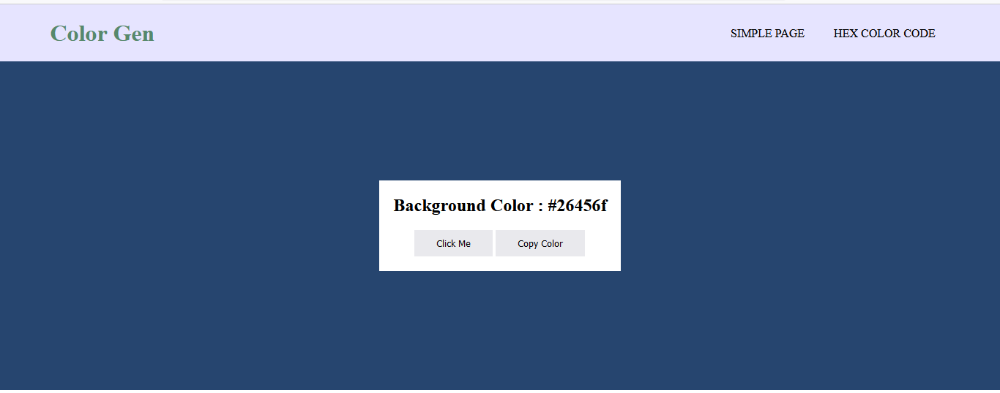

# JS-Basic-Project
My JavaScript Biginner Project

## Status
We make everyday one or two project.

## Template File
### Subject : Our Boilar Template for this course
Info : Teplate File is a simple boilarplate for this coourse project. 

## About Project one
### Subject: Random Color Generator

Info: There have two type of color generator. First one is hex color code generator and second one rgb color code generator.

## About Project Two
### Subject: Counter JS
Info: There have 3 type of button. One is increment, another one is decrement and last one is rest. By click it some event was fire and you can see output in your webpage.

## About Project Three
### Subject: Moblie Menu
Info: Most usefull fecture is moblie menu. It's a simple menu. But when you see this page in your moblie phone, the menu is hide and a button is show up. By clicking the button manu is show. It's very easy and biginner friendly fecture for a website.

## About Project Four
### Subject: Rendom Review Generator
Info: It's a random review generator. Most use in your font end and back-end work in a web application. Here are some option in json file.

## About Project Five
### Subject: Side Bar
Info: It's a Side Bar Menu. Basically you can call it as a mobile menu. But it always stay as a mobile menu. There have no change in big scheen.